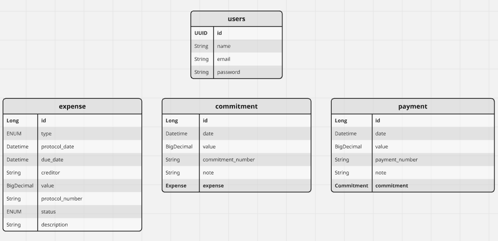
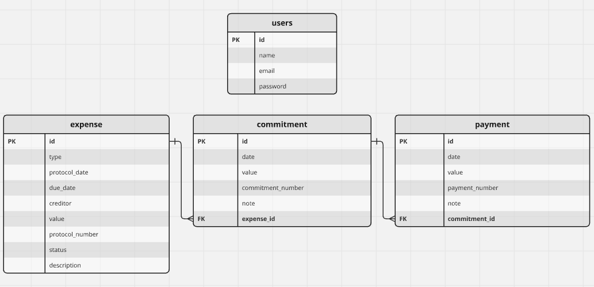

# API de Gestão de Despesas - Teste Técnico

Este é um projeto desenvolvido para um teste técnico. Trata-se de uma API REST em **Spring Boot** para gerenciar despesas (**Expenses**), empenhos (**Commitments**) e pagamentos (**Payments**).

## 📑 Sumário

- [📌 Visão Geral](#-visão-geral)
    - [O Desafio](#o-desafio)
    - [Modelagem do Banco de Dados](#modelagem-do-banco-de-dados)
    - [Relacionamentos entre Entidades](#relacionamentos-entre-entidades)
- [🚀 Tecnologias Utilizadas](#-tecnologias-utilizadas)
- [📦 Como Executar o Projeto](#-como-executar-o-projeto)
- [🛠 Endpoints da API](#-endpoints-da-api)
- [👨‍💻 Autor](#-autor)

---

## 📌 Visão Geral

### O Desafio

O objetivo deste projeto é desenvolver uma API REST para gerenciar despesas. A API possui as seguintes funcionalidades:

✔️ Criar, listar, atualizar e excluir despesas.  
✔️ Criar, listar e excluir empenhos associados a despesas.  
✔️ Criar, listar e excluir pagamentos associados a empenhos.  
✔️ Implementar regras de negócio, como a geração de um número de protocolo único para cada despesa, a restrição da exclusão de despesas com empenhos associados, entre outras funcionalidades.

### Modelagem do Banco de Dados

A API utiliza um banco de dados relacional, com as seguintes entidades e seus tipos de dados:



### Relacionamentos entre Entidades

As relações entre as entidades **Expense**, **Commitment** e **Payment** seguem um modelo `OneToMany`:



---

## 🚀 Tecnologias Utilizadas

Este projeto foi desenvolvido com as seguintes tecnologias:

- **Java 21**
- **Spring Boot 3.4.4**
- **Spring Data JPA** (Hibernate)
- **PostgreSQL**
- **Flyway**
- **Spring Security**
- **JWT (JSON Web Token)**
- **Lombok**

---

## 📦 Como Executar o Projeto

### ✅ Pré-requisitos

Antes de iniciar, você precisará ter instalado:

- **Java 21**
- **Maven**
- **PostgreSQL**
- **Docker** (opcional, caso queira rodar o banco via container)

### 🚀 Rodando a aplicação

1. Clone o repositório:
   ```sh
   git clone https://github.com/Bennev/sop-api.git
   
2. Acesse o diretório do projeto:
    ```sh
    cd sop-api

3. Crie um banco de dados no PostgreSQL e configure as credenciais no application.properties conforme os dados do seu ambiente local. Exemplo:
    ```sh
    api.security.token.secret=${JWT_SECRET:my-secret-key}
    spring.datasource.url=${DATABASE_URL:jdbc:postgresql://localhost:5432/soq}
    spring.application.name=${DATABASE_NAME:sop-api}
    spring.datasource.username=${DATABASE_USER:soq_user}
    spring.datasource.password=${DATABASE_PASSWORD:soq_password}
    server.port=${PORT:8080}
   
4. (Opcional) Se desejar testar via deploy, crie um arquivo chamado .env na raiz do projeto e cole as informações que enviarei separadamente.

5. Rode o projeto com Maven:
    ```sh
    mvn spring-boot:run

6. A API estará disponível em:
    ```sh
    http://localhost:8080

## 🛠 Endpoints da API

### 🔹 **Users (Autenticação)**
| Método | Endpoint         | Descrição                 |
|--------|-----------------|---------------------------|
| `POST` | `/auth/register`     | Registra um novo usuário  |
| `POST` | `/auth/login`      | Autentica e gera um token |

### 🔹 **Expense**
| Método | Endpoint        | Descrição          |
|--------|-----------------|--------------------|
| `GET`  | `/expense`      | Lista todas as despesas |
| `GET`  | `/expense/{id}` | Busca uma despesa específica |
| `POST` | `/expense`      | Cria uma nova despesa |
| `DELETE` | `/expense/{id}` | Remove uma despesa |

### 🔹 **Commitment**
| Método | Endpoint                           | Descrição         |
|--------|------------------------------------|-------------------|
| `GET`  | `/commitment/expense/{expense_id}` | Lista todos os empenhos de uma despesa |
| `GET`  | `/commitment/{id}`                    | Busca um empenho específico |
| `POST` | `/commitment`                         | Cria um novo empenho |
| `DELETE` | `/commitment/{id}`                    | Remove um empenho |

### 🔹 **Payment**
| Método | Endpoint          | Descrição                                               |
|--------|------------------|---------------------------------------------------------|
| `GET`  | `/payment/commitment/{commitment_id}` | Lista todos os pagamentos de um empenho                 |
| `GET`  | `/payment/{id}`                    | Busca um pagamento específico                           |
| `POST` | `/payment`                         | Cria um novo pagamento                                  |
| `DELETE` | `/payment/{id}`                    | Remove um pagamento  |

## 👨‍💻 Autor

- GitHub: [Bennev](https://github.com/Bennev)
- LinkedIn: [Matheus Benevides](http://linkedin.com/in/matheusbenevidesmilitao)

#### 🚀 Feito com 💙 para o teste técnico!